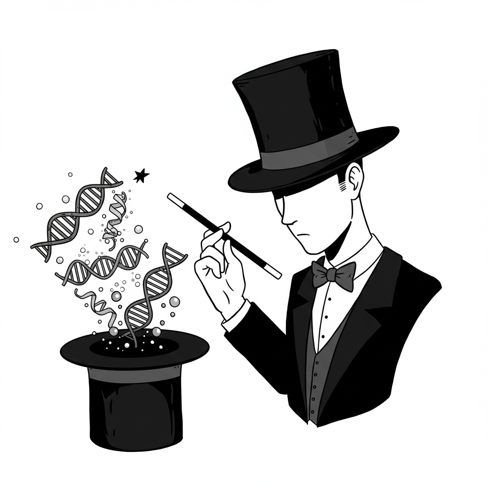

<div id="toc">
  <ul style="list-style: none">
    <summary>
      <h1> IAN: An Intelligent System for Omics Data Analysis and Discovery </h1>
    </summary>
  </ul>
</div>


### **Features:**

*   **Flexible Input:** Supports various input types, including differential expression results from DESeq2, FindMarkers output from Seurat, and custom DEG lists.
*   **Comprehensive Enrichment Analysis:** Performs enrichment analysis using WikiPathways, KEGG, Reactome, Gene Ontology (GO), ChEA (Transcription Factor Enrichment Analysis).
*   **Protein-Protein Interaction Analysis:** Extracts protein-protein interaction data from STRING database. Computes a hub gene score for each protein, based on their network properties.
*   **LLM-Driven Interpretation:** Employs a multi-agent system with carefully crafted LLM prompts to summarize, categorize, integrate and interpret enrichment results, identify key regulators, and explore novel connections for each of the pathway databases.
*   **Pathway Comparison:** Identifies overlapping and unique genes across different pathway databases to provide a more comprehensive understanding of the underlying biological mechanisms.
*   **System Modeling:** Generates a system representation network based on each of the pathway analysis results, integrates them, revises the integrated network, creating a mechanistic model of the system.
*   **Interactive Visualization:** Presents the system model network allowing for interactive exploration of the results.
*   **Automated Report Generation:** Generates a comprehensive HTML report summarizing the analysis results and providing LLM-driven insights.

### **Benefits:**

*   **Integrated Analysis:** Combines multiple analyses approaches and tools into a single, streamlined workflow.
*   **LLM-Powered Insights:** Leverages the power of LLMs to interpret complex data, uncover hidden patterns, and generate insightful summaries and explanations.
*   **Hypothesis Generation:** Facilitates the generation of novel hypotheses about the underlying biological mechanisms.
*   **Systems-Level Understanding:** Provides a systems-level perspective on the data, allowing for a more comprehensive understanding.
*   **Customizable and Extensible:** Designed to be customizable and extensible, allowing users to adapt the system to their specific needs.

### **Installation:**

```R
# Install the necessary packages
install.packages(c("dplyr", "stringr", "readr", "R6", "future", "furrr", "progressr", "httr", "plyr", "rmarkdown", "visNetwork", "igraph", "devtools"))

# Install packages from Bioconductor
if (!requireNamespace("BiocManager", quietly = TRUE)) {
    install.packages("BiocManager")
}
BiocManager::install(c("clusterProfiler", "ReactomePA", "org.Hs.eg.db", "org.Mm.eg.db"))

install.packages("enrichR")

# Install IAN from GitHub
devtools::install_github("your_github_username/IAN") # Replace with your GitHub username and repo name
```

**LLM Server Setup:**
* IAN uses Google Gemini as the LLM. IAN Remote Google Server Setup - obtain api-key following the instructions here:
https://ai.google.dev/gemini-api/docs/api-key

### **Example Usage:**

**Download example data:** [NK, CD4+ and CD8+ T cells from LCMV infected Ifng - CTCF binding site mutant mice - GSM6625298_scRNA_LCMV_Day4_CD4_CD8_NK_WT_filtered_feature_bc_matrix.h5](https://www.ncbi.nlm.nih.gov/geo/download/?acc=GSM6625299&format=file&file=GSM6625299%5FscRNA%5FLCMV%5FDay4%5FCD4%5FCD8%5FNK%5FKO%5Ffiltered%5Ffeature%5Fbc%5Fmatrix%2Eh5)

```
# Load the IAN package
library(IAN)

# Define the path to your API key file
api_key_file <- "path/to/your/api_key.txt" # **REPLACE with the actual path to your API key file**

# Define the path to your DEG file
deg_file_path <- "path/to/your/deg.txt" # Replace with your file path

# Call the function with the correct parameters
IAN(
  deg_file = deg_file_path,
  gene_type = "ENSEMBL",
  organism = "human",
  input_type = "custom",
  output_dir = "IAN_results",
  api_key_file = api_key_file
)
```

### **Tutorial Datasets:**
* [PBMCs from Birdshot Uveitis Patient](https://github.com/PulakNath/bcr-uveitis/raw/refs/heads/main/Results/cellranger/NS7R65BBTS/cellranger_output/filtered_feature_bc_matrix.h5)
* [PBMCs from Healthy Human Control](https://github.com/PulakNath/bcr-uveitis/raw/refs/heads/main/Results/cellranger/NS3R189BTS/cellranger_output/filtered_feature_bc_matrix.h5)
* [NK, CD4+ and CD8+ T cells from LCMV infected WT mice](https://www.ncbi.nlm.nih.gov/geo/download/?acc=GSM6625298&format=file&file=GSM6625298%5FscRNA%5FLCMV%5FDay4%5FCD4%5FCD8%5FNK%5FWT%5Ffiltered%5Ffeature%5Fbc%5Fmatrix%2Eh5)
* [NK, CD4+ and CD8+ T cells from LCMV infected Ifng - CTCF binding site mutant mice](https://www.ncbi.nlm.nih.gov/geo/download/?acc=GSM6625299&format=file&file=GSM6625299%5FscRNA%5FLCMV%5FDay4%5FCD4%5FCD8%5FNK%5FKO%5Ffiltered%5Ffeature%5Fbc%5Fmatrix%2Eh5)

### **Documentation:**

Detailed documentation for each function, including parameters, usage, and expected outputs, is available through the ? help function in R. For example, run ?IAN to learn about all the included functions, run ?map_gene_ids to learn about the syntax, parameters, expected inputs, defaults and outputs about the function that maps gene identifiers.

### **Supporting Files/Scripts:**
- [SCassist Template Prompts](https://nih-nei.github.io/SCassist/SCassist-prompts.md)
- [SCassist Semantic Similarity Evaluation Script](https://nih-nei.github.io/SCassist/bert-similarity.md)

### **License:**

The license for this package can be found in the `LICENSE` file within the package directory.
