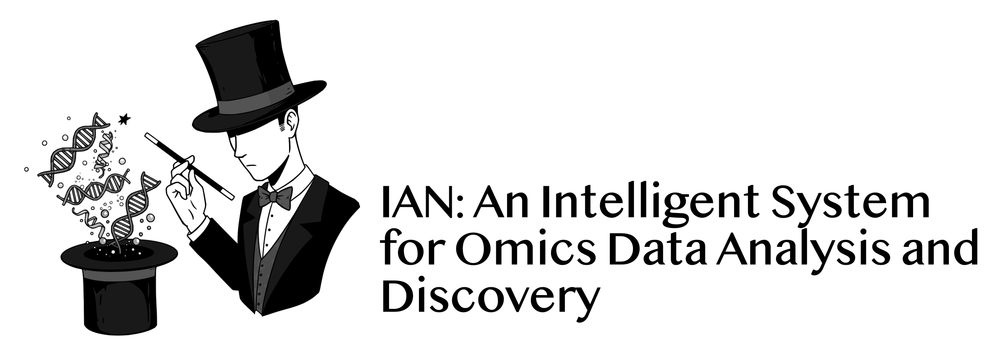

&nbsp;

------------
- Authors: Vijay Nagarajan PhD, Guangpu Shi PhD
- Affiliation: Laboratory of Immunology, NEI/NIH
- Contact: nagarajanv@nih.gov
------------
**IAN** is an R package designed to perform contextually integrated "omics" data analysis and reasoning, leveraging the power of Large Language Models (LLMs) to unravel complex biological systems. IAN uses popular pathway and regulatory datasets, along with the interaction information, to perform enrichment analysis and generate insightful summaries, using a multi-agent AI system.

### **Features:**

*   **Flexible Input:** Supports various input types, including differential expression results from DESeq2, FindMarkers output from Seurat, and custom DEG lists.
*   **Comprehensive Enrichment Analysis:** Performs enrichment analysis using WikiPathways, KEGG, Reactome, Gene Ontology (GO), ChEA (Transcription Factor Enrichment Analysis).
*   **Protein-Protein Interaction Analysis:** Extracts protein-protein interaction data from STRING database. Computes a hub gene score for each protein, based on their network properties.
*   **LLM-Driven Interpretation:** Employs a multi-agent system with carefully crafted LLM prompts to summarize, categorize, integrate and interpret enrichment results, identify key regulators, and explore novel connections for each of the pathway databases.
*   **Pathway Comparison:** Identifies overlapping and unique genes across different pathway databases to provide a more comprehensive understanding of the underlying biological mechanisms.
*   **System Modeling:** Generates a system representation network based on each of the pathway analysis results, integrates them, revises the integrated network, creating a mechanistic model of the system.
*   **Interactive Visualization:** Presents the system model network allowing for interactive exploration of the results.
*   **Automated Report Generation:** Generates a comprehensive HTML report summarizing the analysis results and providing LLM-driven insights.

### **Benefits:**

*   **Integrated Analysis:** Combines multiple analyses approaches and tools into a single, streamlined workflow.
*   **LLM-Powered Insights:** Leverages the power of LLMs to interpret complex data, uncover hidden patterns, and generate insightful summaries and explanations.
*   **Hypothesis Generation:** Facilitates the generation of novel hypotheses about the underlying biological mechanisms.
*   **Systems-Level Understanding:** Provides a systems-level perspective on the data, allowing for a more comprehensive understanding.
*   **Customizable and Extensible:** Designed to be customizable and extensible, allowing users to adapt the system to their specific needs.
*   **Cost effective:** Uses pay-as-you-go low cost API call options to the LLMs.


### **Installation:**

```R
# Install the necessary packages
install.packages(c("dplyr", "stringr", "readr", "R6", "future", "furrr", "progressr", "httr", "plyr", "rmarkdown", "visNetwork", "igraph", "devtools", "ggh4x"))
BiocManager::install(c("clusterProfiler", "ReactomePA", "org.Hs.eg.db", "org.Mm.eg.db", "STRINGdb"))
install.packages("enrichR")

# Install the devtools package if you don't have it
install.packages("devtools")

# Install IAN from GitHub
devtools::install_github("NIH-NEI/IAN")

```

**LLM Server Setup:**
* IAN uses Google Gemini as the LLM.
* IAN Remote Google Server Setup: <br>
Obtain api-key following the instructions here:
https://ai.google.dev/gemini-api/docs/api-key

### **Example Usage:**

* **Download example data:** [List of 180 genes significantly differentially expressed in Uveitis](inst/docs/uveitis-PIIS0002939421000271-deg.txt)
* **Original Publication:** [Rosenbaum et al., 2021](https://pmc.ncbi.nlm.nih.gov/articles/PMC8286715/)


```
# Load the IAN package and enrichR library
library(IAN)
library(enrichR)

# Define the path to your Google Gemini API key file
api_key_file <- "path/to/your/api_key.txt"

# Define the path to the DEG file, that you downloaded from the above example data link
deg_file_path <- "path/to/your/uveitis-PIIS0002939421000271-deg.txt"

# Call the function with basic parameters
IAN(
  deg_file = deg_file_path,
  gene_type = "ENSEMBL",
  organism = "human",
  input_type = "custom",
  output_dir = "IAN_results",
  api_key_file = api_key_file
)

# All the results files are stored in the "IAN_results" folder in your current working directory.
# The example results are also shared in the below links, so you can compare your run with our run.
```

### **Download Evaluation Reports:**
The evaluated reports are provided as compressed zip files containing all the individual results files as well as a comprehensive HTML file that collates the individual results files. Once you unzip the file, please open the main file - report_template.html in a browser. You can navigate other results files from this main file.
* [FN1-centered immune dysregulation in uveitis pathogenesis](inst/docs/ian-uv.zip)
  - Original Publication: [Rosenbaum et al., 2021](https://pmc.ncbi.nlm.nih.gov/articles/PMC8286715/)
* [Behcet’s Disease: A Complex Interplay of Immune and Neuronal Pathways, CX3CR1 Involvement](inst/docs/ian-bd.zip)
  - Original Publication: [Zheng et al., 2022](https://pmc.ncbi.nlm.nih.gov/articles/PMC9245671/)

### **Documentation:**

Detailed documentation for each function, including parameters, usage, and expected outputs, is available through the ? help function in R. For example, run ?IAN to learn about all the included functions, run ?map_gene_ids to learn about the syntax, parameters, expected inputs, defaults and outputs about the function that maps gene identifiers.

### **FAQs**
1. ```ERROR: dependency ‘STRINGdb’ is not available for package ‘IAN’```

  Run ```BiocManager::install("STRINGdb")```

2. ```Error in `library()`: ! there is no package called 'ggh4x'```

  Run ```install.packages("ggh4x")```

3. If you get error like this - ```Error: Cannot create 143 parallel PSOCK nodes. Each node needs one connection, but there are only 140 connections left out of the maximum 144 available on this R installation. To increase this limit in R (>= 4.4.0), use command-line option '--max-connections=N' when launching R.```

  Start R like this - ```R --max-connections=256```

4. If you get error like this - ```Error: package or namespace load failed for 'AnnotationDbi' in loadNamespace(i, c(lib.loc, .libPaths()), versionCheck = vI[[i]]):
 there is no package called 'GenomeInfoDbData'
Execution halted
ERROR: lazy loading failed for package 'org.Mm.eg.db' removing 'C:/Program Files/R/R-4.4.3/library/org.Mm.eg.db'```

  Run ```BiocManager::install(c("GenomeInfoDbData", "AnnotationDbi", "AnnotationHub"))``` and then try installing the "org.Hs.eg.db" and "org.Mm.eg.db" packages.

5. If you get this error - ```Error in loadNamespace(j <- i[[1L]], c(lib.loc, .libPaths()), versionCheck = vI[[j]]) : there is no package called 'GO.db' Calls: <Anonymous> ... loadNamespace -> withRestarts -> withOneRestart -> doWithOneRestart Execution halted ERROR: lazy loading failed for package 'IAN' removing 'C:/Program Files/R/R-4.4.3/library/IAN'```

  Run ```BiocManager::install("GO.db")``` and then try to install IAN


### **Supporting Files/Scripts:**
- [IAN's Analysis Instructions](inst/docs/analysis_instructions.md)
- [IAN's Analysis Instructions](inst/docs/analysis_parameters.md)
- [BERT's Similary Score](inst/docs/bert-similarity.py)
- [Grounding Analysis Script](inst/docs/ground.R)
- [Human Evaluation Script](inst/docs/human-evaluation-plots.R)

### **License:**

The license for this package can be found in the `LICENSE` file within the package directory.
